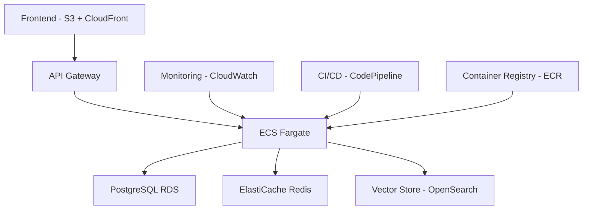

# EU AI Act Q&A System

A modern web application that provides intelligent answers to questions about the EU AI Act using advanced AI and vector embeddings. The system combines the power of Voyage AI for embeddings and Google's Gemini model for generating accurate responses.

## 🌟 Features

- **Intelligent Q&A**: Ask questions about EU AI Act regulations and get accurate answers
- **Vector Search**: Uses advanced embeddings to find relevant information
- **Modern UI**: Clean, responsive interface built with React and Tailwind CSS
- **Real-time Responses**: Fast and accurate answers powered by Gemini AI
- **Database Integration**: PostgreSQL with pgvector for efficient similarity search

## 🏗️ Tech Stack

### Frontend
- React 18 with TypeScript
- Vite for fast development and building
- Tailwind CSS for styling
- React Router for navigation
- Lucide React for icons

### Backend
- FastAPI for the API server
- PostgreSQL with pgvector for vector storage
- Voyage AI for embeddings
- Google Gemini for answer generation
- Python 3.12

## 🚀 Getting Started

### Prerequisites
- Node.js 18+ and npm
- Python 3.12+
- PostgreSQL 15+
- Voyage AI API key
- Google AI API key

### Local Development Setup

1. **Clone the repository**
   ```bash
   git clone <repository-url>
   cd eu-ai-act-qa
   ```

2. **Set up the backend**
   ```bash
   cd backend
   python -m venv venv
   # On Windows
   venv\Scripts\activate
   # On Unix or MacOS
   source venv/bin/activate
   
   pip install -r src/requirements.txt
   ```

3. **Set up the database**
   ```bash
   # Create a PostgreSQL database
   createdb eu_ai_act
   
   # Run database setup
   python src/db_setup.py
   ```

4. **Configure environment variables**
   Create a `.env` file in `backend/src/`:
   ```env
   DB_HOST=localhost
   DB_PORT=5432
   DB_NAME=eu_ai_act
   DB_USER=your_username
   DB_PASSWORD=your_password
   VOYAGE_API_KEY=your_voyage_key
   GOOGLE_API_KEY=your_google_key
   ```

5. **Set up the frontend**
   ```bash
   cd frontend
   npm install
   ```

6. **Start the development servers**
   ```bash
   # Terminal 1 - Backend
   cd backend
   uvicorn src.api:app --reload --port 8000

   # Terminal 2 - Frontend
   cd frontend
   npm run dev
   ```

The application will be available at:
- Frontend: http://localhost:5173
- Backend API: http://localhost:8000
- API Documentation: http://localhost:8000/docs

## 🚀 Deployment

### AWS Infrastructure Overview

The application is deployed using AWS services with MLOps best practices:



### Infrastructure as Code (IaC)

The infrastructure is defined using AWS CDK in TypeScript:

```typescript
// Example CDK stack structure
class EUAIActStack extends cdk.Stack {
  constructor(scope: cdk.App, id: string, props?: cdk.StackProps) {
    super(scope, id, props);
    
    // VPC and Network Configuration
    const vpc = new ec2.Vpc(this, 'VPC', {
      maxAzs: 2,
      natGateways: 1
    });

    // ECS Cluster
    const cluster = new ecs.Cluster(this, 'Cluster', { vpc });

    // RDS Instance
    const database = new rds.DatabaseInstance(this, 'Database', {
      engine: rds.DatabaseInstanceEngine.postgres({ version: rds.PostgresEngineVersion.VER_15 }),
      vpc,
      instanceType: ec2.InstanceType.of(ec2.InstanceClass.T3, ec2.InstanceSize.MEDIUM),
      storageEncrypted: true
    });

    // OpenSearch Domain for Vector Store
    const vectorStore = new opensearch.Domain(this, 'VectorStore', {
      vpc,
      version: opensearch.EngineVersion.OPENSEARCH_2_7,
      capacity: {
        dataNodes: 2,
        dataNodeInstanceType: 't3.medium.search'
      }
    });

    // ECS Service
    const service = new ecs.FargateService(this, 'Service', {
      cluster,
      taskDefinition: new ecs.FargateTaskDefinition(this, 'TaskDef', {
        memoryLimitMiB: 2048,
        cpu: 1024,
        runtimePlatform: {
          cpuArchitecture: ecs.CpuArchitecture.X86_64,
          operatingSystemFamily: ecs.OperatingSystemFamily.LINUX
        }
      })
    });
  }
}
```

### MLOps Pipeline

1. **Model Training and Evaluation**
   ```yaml
   # Example SageMaker pipeline
   version: 1
   parameters:
     training_data: str
     model_name: str
     evaluation_threshold: float
   
   steps:
     - name: preprocess
       type: Processing
       arguments:
         ProcessingResources:
           ClusterConfig:
             InstanceCount: 1
             VolumeSizeInGB: 50
             InstanceType: ml.m5.xlarge
         AppSpecification:
           ImageUri: ${ECR_REPO}/preprocessing:latest
   
     - name: train
       type: Training
       arguments:
         AlgorithmSpecification:
           TrainingInputMode: File
           TrainingImage: ${ECR_REPO}/training:latest
         ResourceConfig:
           InstanceCount: 2
           VolumeSizeInGB: 50
           InstanceType: ml.m5.xlarge
   
     - name: evaluate
       type: Processing
       arguments:
         ProcessingResources:
           ClusterConfig:
             InstanceCount: 1
             VolumeSizeInGB: 50
             InstanceType: ml.m5.xlarge
         AppSpecification:
           ImageUri: ${ECR_REPO}/evaluation:latest
   ```

2. **Model Monitoring**
   ```python
   # Example CloudWatch metrics for model monitoring
   from sagemaker.model_monitor import DataQualityMonitor
   
   data_quality_monitor = DataQualityMonitor(
       role=role,
       instance_count=1,
       instance_type='ml.m5.xlarge',
       volume_size_in_gb=20,
       max_runtime_in_seconds=3600,
       base_job_name='data-quality-monitor'
   )
   
   data_quality_monitor.suggest_baseline(
       baseline_dataset='s3://bucket/baseline.csv',
       dataset_format={'csv': {'header': True}},
       record_preprocessor_script='preprocessor.py'
   )
   ```

### Deployment Steps

1. **Set up AWS CLI and configure credentials**
   ```bash
   aws configure
   ```

2. **Deploy Infrastructure**
   ```bash
   # Install AWS CDK
   npm install -g aws-cdk
   
   # Deploy infrastructure
   cd infrastructure
   cdk deploy --all
   ```

3. **Build and Push Docker Images**
   ```bash
   # Build backend image
   cd backend
   docker build -t eu-ai-act-backend .
   aws ecr get-login-password | docker login --username AWS --password-stdin ${ECR_REPO}
   docker tag eu-ai-act-backend:latest ${ECR_REPO}/backend:latest
   docker push ${ECR_REPO}/backend:latest
   
   # Build frontend image
   cd frontend
   docker build -t eu-ai-act-frontend .
   docker tag eu-ai-act-frontend:latest ${ECR_REPO}/frontend:latest
   docker push ${ECR_REPO}/frontend:latest
   ```

4. **Deploy Application**
   ```bash
   # Update ECS service
   aws ecs update-service --cluster eu-ai-act-cluster --service backend-service --force-new-deployment
   aws ecs update-service --cluster eu-ai-act-cluster --service frontend-service --force-new-deployment
   ```

### Monitoring and Observability

1. **CloudWatch Metrics**
   - Model performance metrics
   - API latency and error rates
   - Resource utilization
   - Cost tracking

2. **X-Ray Tracing**
   ```python
   from aws_xray_sdk.core import xray_recorder
   from aws_xray_sdk.core import patch_all
   
   patch_all()
   
   @xray_recorder.capture('generate_answer')
   def generate_answer(self, query: str, relevant_chunks: List[Dict]) -> str:
       # Existing code
   ```

3. **SageMaker Model Monitor**
   - Data drift detection
   - Model quality monitoring
   - Bias detection
   - Feature attribution

### CI/CD Pipeline

```yaml
# Example GitHub Actions workflow
name: CI/CD Pipeline

on:
  push:
    branches: [ main ]
  pull_request:
    branches: [ main ]

jobs:
  test:
    runs-on: ubuntu-latest
    steps:
      - uses: actions/checkout@v2
      - name: Set up Python
        uses: actions/setup-python@v2
      - name: Run tests
        run: |
          cd backend
          pip install -r requirements.txt
          pytest
          
  build-and-push:
    needs: test
    runs-on: ubuntu-latest
    steps:
      - uses: actions/checkout@v2
      - name: Configure AWS credentials
        uses: aws-actions/configure-aws-credentials@v1
      - name: Login to Amazon ECR
        id: login-ecr
        uses: aws-actions/amazon-ecr-login@v1
      - name: Build and push Docker images
        run: |
          docker build -t ${{ env.ECR_REPO }}/backend:${{ github.sha }} ./backend
          docker build -t ${{ env.ECR_REPO }}/frontend:${{ github.sha }} ./frontend
          docker push ${{ env.ECR_REPO }}/backend:${{ github.sha }}
          docker push ${{ env.ECR_REPO }}/frontend:${{ github.sha }}
          
  deploy:
    needs: build-and-push
    runs-on: ubuntu-latest
    steps:
      - name: Deploy to ECS
        run: |
          aws ecs update-service --cluster eu-ai-act-cluster --service backend-service --force-new-deployment
          aws ecs update-service --cluster eu-ai-act-cluster --service frontend-service --force-new-deployment
```

### Cost Optimization

1. **Auto Scaling**
   ```typescript
   // Example auto-scaling configuration
   const autoScalingGroup = service.autoScaleTaskCount({
     minCapacity: 1,
     maxCapacity: 10
   });
   
   autoScalingGroup.scaleOnCpuUtilization('CpuScaling', {
     targetUtilizationPercent: 70,
     scaleInCooldown: cdk.Duration.seconds(60),
     scaleOutCooldown: cdk.Duration.seconds(60)
   });
   ```

2. **Resource Scheduling**
   - Use AWS EventBridge to scale down resources during non-peak hours
   - Implement spot instances for non-critical workloads
   - Use AWS Savings Plans for predictable workloads

## 📚 API Documentation

The API provides the following endpoints:

### POST /api/ask
Ask a question about the EU AI Act.

**Request Body:**
```json
{
  "text": "What are the key requirements for high-risk AI systems?"
}
```

**Response:**
```json
{
  "answer": "Detailed answer about high-risk AI systems...",
  "chunks": [
    {
      "text": "Relevant text chunk...",
      "metadata": {},
      "distance": 0.123
    }
  ]
}
```

## 🧪 Testing

### Backend Tests
```bash
cd backend
pytest
```

### Frontend Tests
```bash
cd frontend
npm test
```

## 📝 Contributing

1. Fork the repository
2. Create your feature branch (`git checkout -b feature/amazing-feature`)
3. Commit your changes (`git commit -m 'Add some amazing feature'`)
4. Push to the branch (`git push origin feature/amazing-feature`)
5. Open a Pull Request

## 📄 License

This project is licensed under the MIT License - see the [LICENSE](LICENSE) file for details.

## 🙏 Acknowledgments

- EU AI Act documentation
- Voyage AI for embeddings
- Google AI for Gemini model
- FastAPI team
- React and Vite communities

## 🔧 Troubleshooting

### Common Issues

1. **Database Connection Issues**
   - Verify PostgreSQL is running
   - Check database credentials in .env
   - Ensure database exists

2. **API Key Issues**
   - Verify API keys are correctly set in environment variables
   - Check API key permissions

3. **Build Issues**
   - Clear node_modules and reinstall dependencies
   - Update npm/pip to latest versions
   - Check for conflicting package versions

## 📞 Support

For support, please:
1. Check the [Issues](issues) page
2. Create a new issue if needed
3. Contact the maintainers

## 🔄 Updates

- Check the [CHANGELOG.md](CHANGELOG.md) for version history
- Follow the repository for updates
- Star the project to show support 